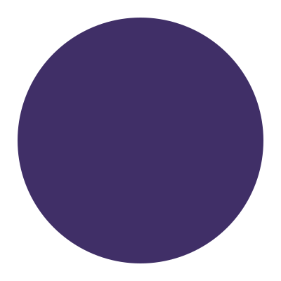
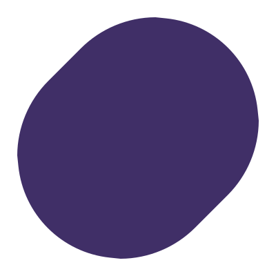

# materialshapes-python
## STILL IN DEVLOPMENT

<h2 align="center">Preview</h2>

<table align="center">
  <tr>
    <td align="center"><br/>circle</td>
    <td align="center"><br/>square</td>
    <td align="center"><br/>slanted</td>
    <td align="center"><br/>arch</td>
    <td align="center"><br/>semiCircle</td>
  </tr>
  <tr>
    <td align="center"><br/>oval</td>
    <td align="center"><br/>pill</td>
    <td align="center"><br/>triangle</td>
    <td align="center"><br/>arrow</td>
    <td align="center"><br/>fan</td>
  </tr>
  <tr>
    <td align="center"><br/>diamond</td>
    <td align="center"><br/>clamShell</td>
    <td align="center"><br/>pentagon</td>
    <td align="center"><br/>gem</td>
    <td align="center"><br/>sunny</td>
  </tr>
  <tr>
    <td align="center"><br/>verySunny</td>
    <td align="center"><br/>cookie4Sided</td>
    <td align="center"><br/>cookie6Sided</td>
    <td align="center"><br/>cookie7Sided</td>
    <td align="center"><br/>cookie9Sided</td>
  </tr>
  <tr>
    <td align="center"><br/>cookie12Sided</td>
    <td align="center"><br/>clover4Leaf</td>
    <td align="center"><br/>clover8Leaf</td>
    <td align="center"><br/>burst</td>
    <td align="center"><br/>softBurst</td>
  </tr>
  <tr>
    <td align="center"><br/>boom</td>
    <td align="center"><br/>softBoom</td>
    <td align="center"><br/>flower</td>
    <td align="center"><br/>puffy</td>
    <td align="center"><br/>puffyDiamond</td>
  </tr>
  <tr>
    <td align="center"><br/>ghostish</td>
    <td align="center"><br/>pixelCircle</td>
    <td align="center"><br/>pixelTriangle</td>
    <td align="center"><br/>bun</td>
    <td align="center"><br/>heart</td>
  </tr>
</table>

---

Generated using:

```bash
python3 image_gen.py
```


## Examples


File: `kivy.py`

Run using:
```
python3 -m examples.kivy
```


https://github.com/user-attachments/assets/31c2ae03-9be8-4a34-b95d-b7e7219773b1


File: `loading_indicator.py`

Run using:
```
python3 -m examples.loading_indicator
```


https://github.com/user-attachments/assets/c52553f1-c4f0-4af1-8360-f72acfd78949
